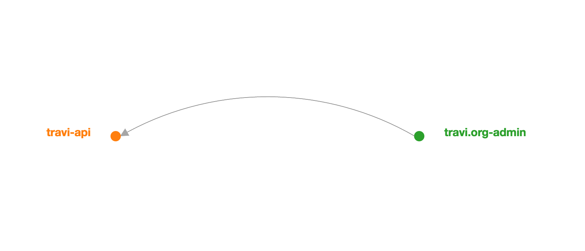

# pact-broker

an instance of [pact-broker](https://github.com/bethesque/pact_broker),
initially to define the contract between my [api](https://github.com/travi/travi-api) (provider)
and the [admin web-app](https://github.com/travi/travi.org-admin) (consumer)

